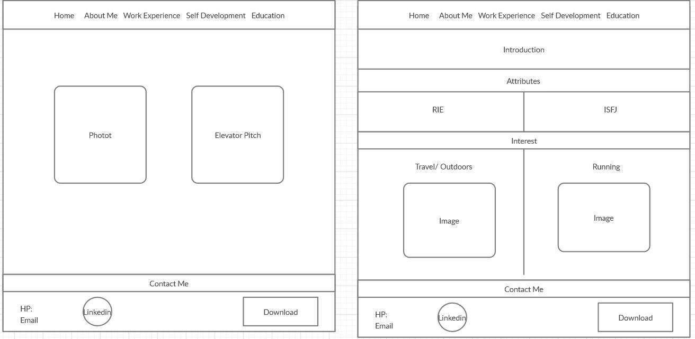
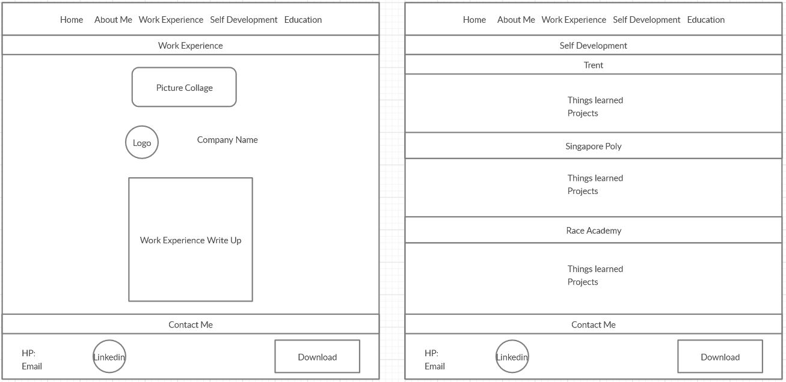
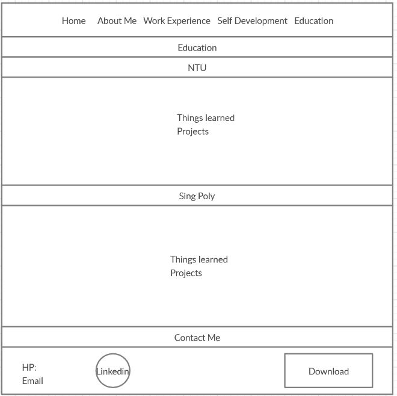

# Fareez Aziz Resume Website

## Project 1: User Centric Frontend Development 

### Context
This website is designed to showcase the user's resume in the form of a website. It is designed to incorporate aspects of the user's education and work history to be able to get the recruiters' attention and contact.
It is meant to be able to show the user as more than just a worker but also a person whom the recruiters feel can assimilate in their corporate culture and someone they would one to have as a colleague.
It is to give a more holisitc view of the user's profile.

## UX

### Strategy

The design for this website aims to showcase the soft skills and hard skills of the user in mind. It also takes into account from the recruiter's point of view of what they would like to see in a candidate.

1. As a job seeker, I would like to be able to show my character to potential recruiters so that they can contact me should they find that I may be suitable for their company.
2. As a job seeker, I would like to be able to showcase my skillsets and experiences so that I may be offered various roles for a job.
3. As a recruiter, I would like to hire a candidate that will fit into my company culture for the current vacancy.
4. As a recruiter, I would like to contact a candidate that is adaptable to the changing demands of the economy for an interview.

The website follows the 3 click rule to ensure that the user and recruiter can access to any information quickly.
It is minimalist and clean design to allow easy navigation of the pages and enable users to identify where the information is placed.
It is also mobile responsive for mobile, tablet and laptops.

### Wireframe

The wire frame illustrates the strategy above.

The navbar is placed at the top to allow the users to locate where they are add and where they want to go.
Contact list is placed at the footer so that whenver a recruiter require contact information it is readily available.
The index starts off with a photo and an elevator pitch to entice the recruiter.
3 top skills of the user is showcased as well.

In the about me page, it shows the attribute profile base on Holland code and Myers-Briggs while below the page shows the interest.
This would give the recruiter a sensing of the user's character and if they can fit in the company.
In the work experience page, theere is a picture collage of an oil rig and its environment.
This is to allow the recruiter to visualize the working environment that the user has undergone to better understand the how the user had perform his duties.

In the self-development page, the courses that the user has taken or is taking will be shown to indicate the skills that has been gained since leaving the previous job.
In the education page, it will highlight the projects that were done in schools.
Both of these highlight character and skills that allows the user to be adaptable and gives the recruiter different aspect of the user profile.

## Features

- Navigation bar at the top of the pages to link it to other pages, it is mobile responsive and collapsible
- Logo (cutout of face photo) brings the page back to index.html
- Footer links the user's Linkedin profile
- In self development, there are links to the user respositories, Numpy and Pandas project and a facebook video of Race Academy
- A video with controls plays a UAV flying
- Download resume button is meant to allow recruiters to download resume

### Features Left to Implement
- Download resume button to be linked to actual resume so that is can be downloaded but as of this point JavaScript has not been taught
- Picture collage in work experience can be replaced with a carousel for mobile version so that the recruiter does not have to scroll down so much

## Technologies Used
1. HTML, https://whatwg.org/, to structure the website
2. CSS, https://www.w3.org/Style/CSS/, to style the website
3. Bootstrap (4.5), https://getbootstrap.com/, to create navigation bar
4. GoogleFonts, https://fonts.google.com/, to style the typography
5. FontAwesome, https://fontawesome.com/, to style Linkedin icon

## Testing

## Deployment

## Credits

